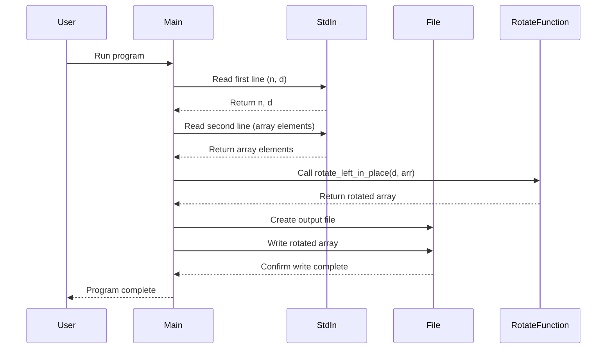

<<<<<<< HEAD
[](https://codecov.io/gh/arturogonzalezm/rotate_left)

# Array Rotation Program

This Rust program performs a left rotation on an array of integers. It reads input from stdin, rotates the array in-place, and writes the result to a file.

## Features

- In-place array rotation algorithm
- Efficient memory usage
- Reads input from stdin
- Writes output to a file (configurable via environment variable)
- Error handling for invalid inputs

## Usage

1. Compile the program:
   ```
   rustc main.rs
   ```

2. Run the program:
   ```
   ./main
   ```

3. Input format:
    - First line: Two space-separated integers `n` and `d`
        - `n`: Number of elements in the array
        - `d`: Number of left rotations to perform
    - Second line: `n` space-separated integers representing the array

    ```bash
    5 4
    1 2 3 4 5
    ````

4. The program will output the rotated array to a file (default: `output.txt`)

## Environment Variables

- `OUTPUT_PATH`: Set this to specify a custom output file path. If not set, the program defaults to `output.txt`.

## Algorithm

The program uses an efficient in-place rotation algorithm:
1. Reverse the entire array
2. Reverse the first `n-d` elements
3. Reverse the remaining `d` elements

This approach achieves the rotation without using additional memory proportional to the array size.

## Error Handling

The program includes error handling for:
- Missing input
- Invalid number parsing
- Mismatched array length
- File I/O errors

## Sequence Diagram



This sequence diagram illustrates the flow of the program, showing how it interacts with standard input, the rotation function, and file output.

## License

This program is open-source and available under the MIT License.
=======
# rotate_left
>>>>>>> origin/main
